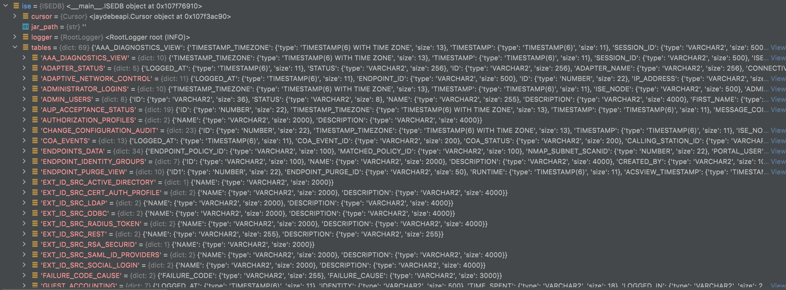
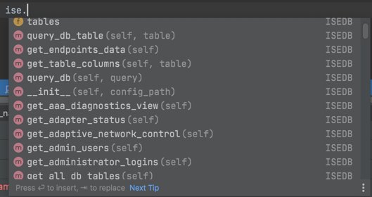
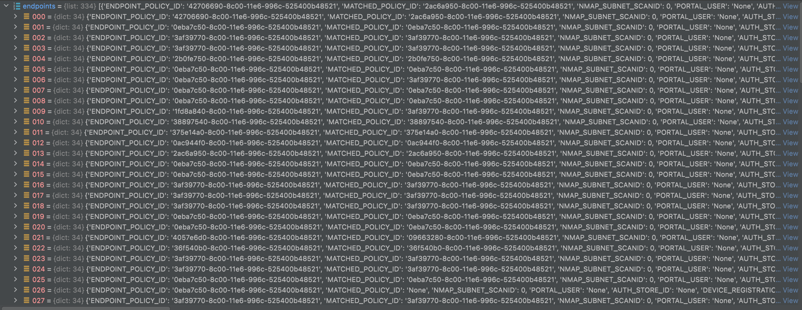
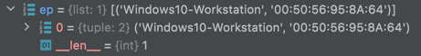
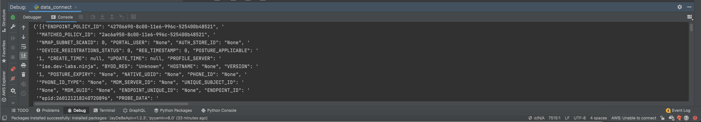

# Cisco ISE DataConnector

<p>This project provides a python wrapper for interacting with the ISE database using the Data Connect feature</p>

### Requirements
1. Ensure your ISE deployment is greater than 3.2, and you have appropriate licensing
2. Enable the Data Connect feature, see [Enable Data Connect](https://www.cisco.com/c/en/us/td/docs/security/ise/3-2/admin_guide/b_ise_admin_3_2/b_ISE_admin_32_basic_setup.html#Cisco_Task.dita_c3fb73c6-d211-47db-8dd9-cb272d737825)
3. Follow the appropriate process for obtaining required certificates 
   1. For ISE 3.2, see [Export Data Connect Certificate](https://www.cisco.com/c/en/us/td/docs/security/ise/3-2/admin_guide/b_ise_admin_3_2/b_ISE_admin_32_basic_setup.html#Cisco_Task.dita_c3fb73c6-d211-47db-8dd9-cb272d737825)
   2. For ISE 3.3, see [Using Admin Certificate with Data Connect](https://www.cisco.com/c/en/us/td/docs/security/ise/3-3/admin_guide/b_ise_admin_3_3/b_ISE_admin_33_basic_setup.html#Cisco_Task.dita_c3fb73c6-d211-47db-8dd9-cb272d737825)
4. Add the Data Connect Certificate to local Trust Store `keytool -import -alias <Name> -file <Data Connect certificate file path and name> -storetype JKS -keystore <trust store name>`
5. Install appropriate JDBC Runtime JAR, [OJDBC11](https://repo1.maven.org/maven2/com/oracle/database/jdbc/ojdbc11/23.2.0.0/ojdbc11-23.2.0.0.jar)
6. Install all required dependencies `pip install -r requirements.txt`
7. Update config.yaml file with the following
   1. Hostname of ISE
   2. Data Connect Password 
   3. Projects Log File Directory
   4. Path to JAR file
   5. Path to Trust Store
   6. Trust Store Password

Config.yaml example:

```yaml
ise:
  hostname: 'ISE-Hostname'
  port: 2484
  dataconnect_password: 'dataconnect-password'
  log_path: '/Absolute/File/Path'
  jar_file_path: '/Absolute/JRE/Path'
  trust_store_path: '/Absolute/Trust_Store/Path'
  trust_store_password: 'trust-store-password'
```

## Usage

Use by creating importing the package and creating an ISEDB object

```python
from data_connect import ISEDB
ise = ISEDB('config.yaml')
```



Upon initialization the ISE DB schema will be generated </br>
</br>
The ISE object natively provides methods for pulling data from all data connect views



For example calling the get_endpoints_data() returns:



Additionally, the query_db() method allows for any SQL query to be run against the ISE DB such as:

```sql
SELECT ENDPOINT_POLICY, MAC_ADDRESS FROM ENDPOINTS_DATA WHERE ENDPOINT_IP = '192.168.200.50'
```


Will return the following:



### Example

```python
import pprint
import json
from data_connect import ISEDB

ise = ISEDB('config.yaml')
endpoints = ise.get_endpoints_data()
pprint.pprint(json.dumps(endpoints))
```

### Output

